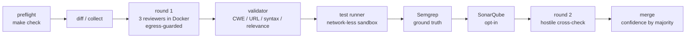

# ABOUTME: Living retrospective for claude-advanced-review: decisions, bugs, lessons
# ABOUTME: Conversational knowledge capture; newest lessons appended at the bottom of each section

# LEARNING.md

## Project Overview

A code-review pipeline that makes LLM reviewers put up or shut up. Three
reviewers from three different labs (Claude, Gemini, DeepSeek) run in isolated
Docker containers, a deterministic validator drops unprovable claims, Semgrep
provides ground truth (SonarQube opt-in), and a hostile cross-check round tries
to demolish whatever survives. The human only sees findings that cleared every
gate.

The recurring theme of this project: the pipeline reviews untrusted code, so
the pipeline itself is an attack surface. Most of what we learned falls out of
taking that sentence seriously.

## Architecture

Reviewer containers sit on an internal Docker network and reach the outside
only through an allowlisting squid proxy. LLM-proposed tests execute in an
ephemeral `--network none` container, never on the host.

## Tech Stack & Decisions

| Technology | Why | Trade-offs |
|------------|-----|------------|
| Python + uv, stdlib argparse | Glue code, no framework needed | None felt yet |
| One Docker image per reviewer CLI | Lab-level isolation, per-CLI auth | Three images to keep updated |
| squid as egress proxy | Battle-tested allowlisting CONNECT proxy, official image | Config read at container start; allowlist change needs container recreation |
| Semgrep default, SonarQube opt-in | Semgrep is stateless and fast; SonarQube needs a persistent server, 60-120s cold boot, port 9000 | Opt-in means SonarQube findings absent unless asked for (contract tracks whether that costs us) |
| Findings survive as data, not prose | `sandbox_unavailable`, `original_severity`, `original_id` keep the audit trail | Slightly fatter JSON |

## Lessons Learned

### 2026-07-07: Two copies of a pipeline are two pipelines

**Context:** `pipeline()` (diff mode) and `pipeline_repo()` (full-repo mode)
were near-identical, ~170 lines each. **Problem:** they had already diverged
in the worst possible way: repo mode forwarded the argparse default
`diff_mode="staged"` to the SonarQube runner, so a "full repo review"
silently scanned only the staged diff. Nobody chose that behavior; it
emerged from copy-paste plus an unrelated default. **Solution:** extracted
six shared stage helpers; each mode dropped to ~90 lines and the divergence
became impossible to express. **Takeaway:** duplication is not a style
finding. Given time, two copies will disagree, and the disagreement will look
exactly like working code.

### 2026-07-07: The review pipeline was the best attack vector in the repo

**Context:** we ran a 360-degree review of the reviewer itself (four parallel
review agents). **Problem:** the isolation was uneven in a way that is easy
to miss: LLMs were carefully boxed in read-only Docker containers, and then
`test_runner.py` took the code those LLMs wrote (from reading an untrusted
diff!) and executed it on the host with `pytest`/`npm test`/`go test`. The
only gates were a syntax parse and a relevance check, neither of which
constrains behavior. Prompt injection in a reviewed diff was a straight line
to API-key exfiltration. **Solution:** execution moved into an ephemeral
`--network none --read-only` container with pid/mem limits and no host
fallback; a new `sandbox_unavailable` status keeps unverifiable findings
visible instead of silently proven or dropped. **Takeaway:** trace the data
flow of everything an LLM produces. Isolating the model but executing its
output raw is security theater.

### 2026-07-07: Smoke-test infrastructure assumptions before writing the code

**Context:** two deferred fixes needed the reviewer CLIs to (a) read prompts
from stdin and (b) work behind an HTTP proxy on a no-route internal network.
Both were "should work" claims about three different CLIs we don't control.
**Problem:** landing either change blind risked bricking all three reviewers
at once, discovered only on the next paid review. **Solution:** before
touching orchestrator.py we ran one-line smoke tests against the real images
(`echo prompt | docker run -i ...`) and a real squid on a real internal
network (curl to an allowed host, a denied host, and with no proxy). Total
cost: a few cents of API calls and ten minutes. Then the unit tests mocked
what we had just proven. **Takeaway:** when the design rests on third-party
behavior, buy the certainty first. Mocks encode assumptions; smoke tests
check them.

### 2026-07-07: Egress allowlists must be exact hosts, never wildcard domains

**Context:** the egress guard needed Gemini's API host. The tempting entry
was `.googleapis.com`. **Problem:** that wildcard also matches
`storage.googleapis.com`, which is a perfectly good exfiltration endpoint;
the allowlist would have quietly reopened the hole it existed to close.
**Solution:** exact hosts only (`generativelanguage.googleapis.com`,
`oauth2.googleapis.com`), and a unit test that parses the squid ACL line and
fails on any leading-dot token. **Takeaway:** an egress allowlist with a
wildcard on a multi-tenant domain is a deny-list wearing a costume.

### 2026-07-07: Our "e2e" tests never called the pipeline

**Context:** `tests/e2e/test_orchestrator_e2e.py` looked comprehensive.
**Problem:** every test re-implemented the pipeline flow by hand: canned
findings through the real validator and merger, but `pipeline()`,
`pipeline_repo()` and `main()` were never invoked. Return codes, the
surviving-findings filter, and stage wiring had zero coverage; the repo-mode
SonarQube bug lived exactly there. **Solution:** real e2e tests that drive
`O.main(argv)` on a temp git repo with only the Docker/LLM/SAST boundaries
stubbed. They immediately earned their keep twice: locking the repo-mode fix,
and catching that the new egress gate was placed before the empty-diff check
(which would have made error-path exits depend on Docker being installed).
**Takeaway:** a test that replays the flow by hand verifies the replay, not
the flow. If `main()` is never called, entry-point regressions are invisible.

### 2026-07-07: Five parallel engineers, zero collisions, one rule

**Context:** 25 review findings fixed by five parallel agent workstreams in
one shared working tree. **Problem:** two workstreams touched the same
module family: one refactoring orchestrator.py, another writing tests against
orchestrator.py's reviewer functions. **Solution:** disjoint file scopes plus
one explicit freeze: "run_claude/run_gemini/run_deepseek signatures are
FROZEN; your refactor must not change them." The refactorer worked around the
frozen surface; the test-writer's 23 tests passed unchanged against the
refactored file. **Takeaway:** parallel agents don't need locks, they need
declared interfaces. Freeze the boundary, not the files.

### 2026-07-07: Fail-open exception handling turns bugs into clean scans

**Context:** `sonarqube_runner.py` wrapped API calls in
`except (RequestException, Exception)`, returning `[]`. **Problem:** that is
a bare `except Exception` with extra typing; any bug in the runner produced
an empty findings list indistinguishable from "the scan found nothing". A
ground-truth reviewer that fails open is worse than none, because it
manufactures false confidence. **Solution:** catch exactly what the network
layer can throw (`RequestException`, `ValueError`/`KeyError` from JSON
parsing), let everything else propagate and crash loudly. **Takeaway:** in a
pipeline whose product is absence-of-findings, silent failure is a
correctness bug, not a robustness feature.

## Pitfalls & Gotchas

- **Docker Desktop containerd image store:** `docker images` lists
  `claude-reviewer:latest` but `docker inspect claude-reviewer:latest` says
  "no such object". Inspect by image ID instead. Cost us ten confused
  minutes.
- **zsh history modifiers eat your tags:** `docker inspect $img:latest`
  becomes `claude-revieweratest` because zsh interprets `:l` as the lowercase
  modifier. Always `${img}:latest` in zsh scripts.
- **squid reads its config once, at start:** the conf is a bind mount, so
  editing the allowlist does nothing until the container is recreated.
  `ensure_egress_guard()` hashes the conf and recreates the proxy on change;
  if you bypass it, remember `docker rm -f advanced-review-proxy`.
- **Internal Docker networks have no external DNS**, and that's fine: with an
  HTTP CONNECT proxy the proxy does the resolving. Don't add DNS "fixes".
- **Gemini CLI startup noise:** it now prints `[STARTUP] ...` lines on
  stdout. Harmless here because `extract_json` takes the last fenced block,
  but don't parse Gemini stdout line-by-line without filtering.
- **Substring assertions on hostnames backfire:** asserting
  `".googleapis.com " not in conf` fails because the legitimate exact host
  `generativelanguage.googleapis.com ` contains that substring. Parse the ACL
  line into tokens and check for leading dots.

## Best Practices Discovered

- **Change contracts with falsification criteria** (see
  `quality_reports/harness_changes/`): every harness-level change ships with
  "what observation would prove this made things worse" written down before
  merge. Three landed today; issue #8 tracks closing their Result tables.
- **Fail-closed security gates with explicit overrides:** the egress guard
  aborts the review (exit 4) if it can't start, and the only way to run
  open-network is the visible `--no-egress-guard` flag. A guard that degrades
  silently is not a guard.
- **Status vocabularies that preserve epistemic state:** `sandbox_unavailable`
  is neither "proven" nor "false", and the merge keeps `original_severity` /
  `original_id` when verdicts mutate a finding. If the pipeline changes its
  mind, the audit trail should show both minds.
